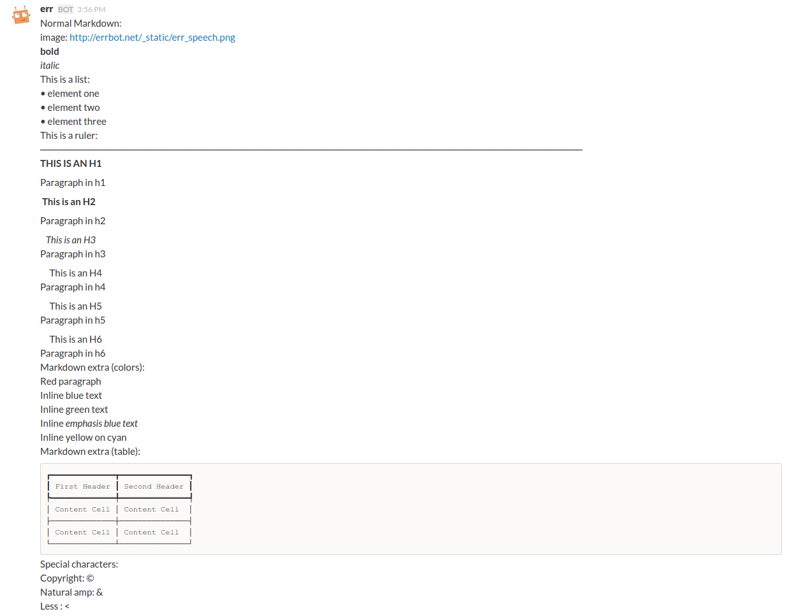
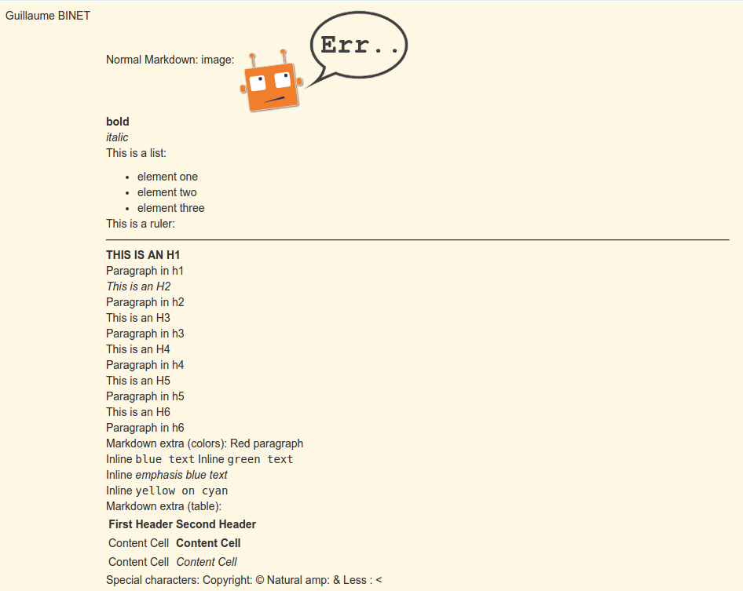
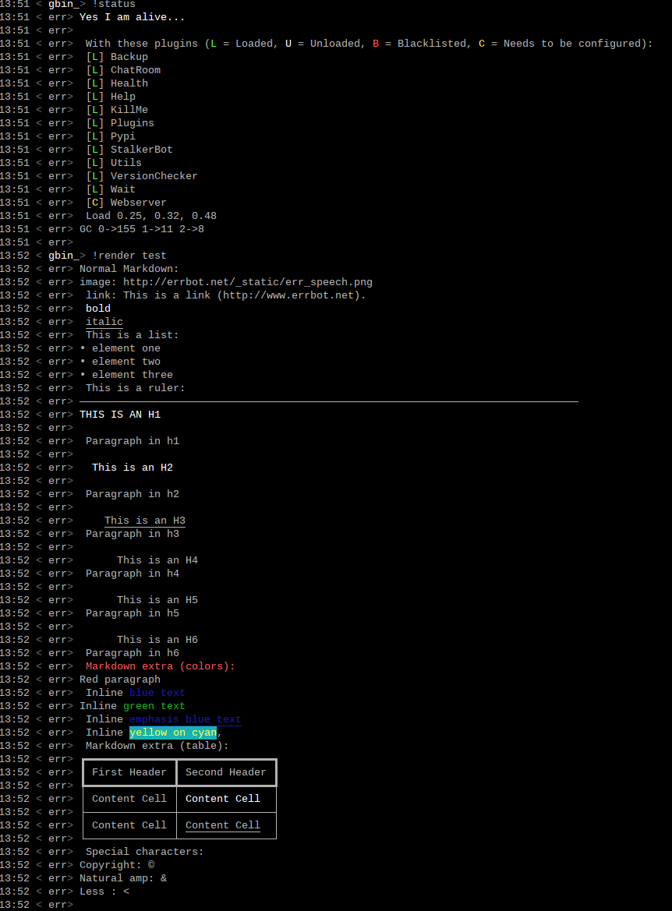
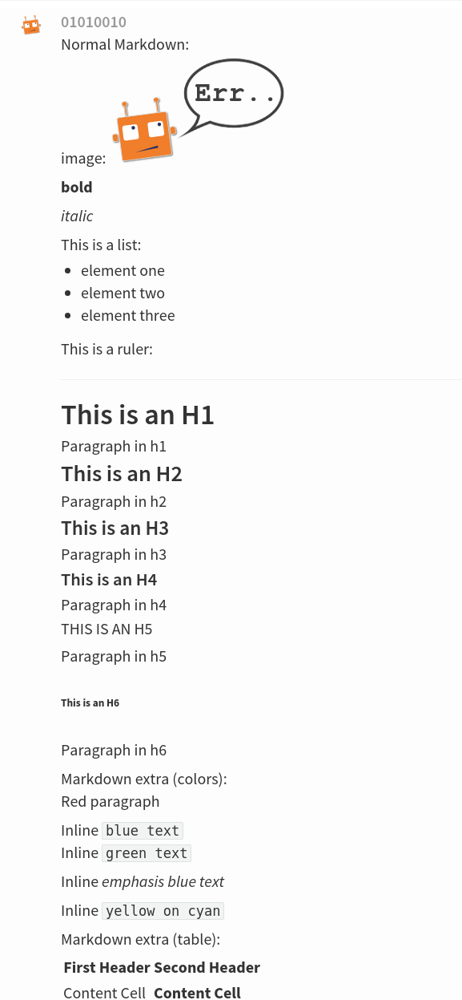
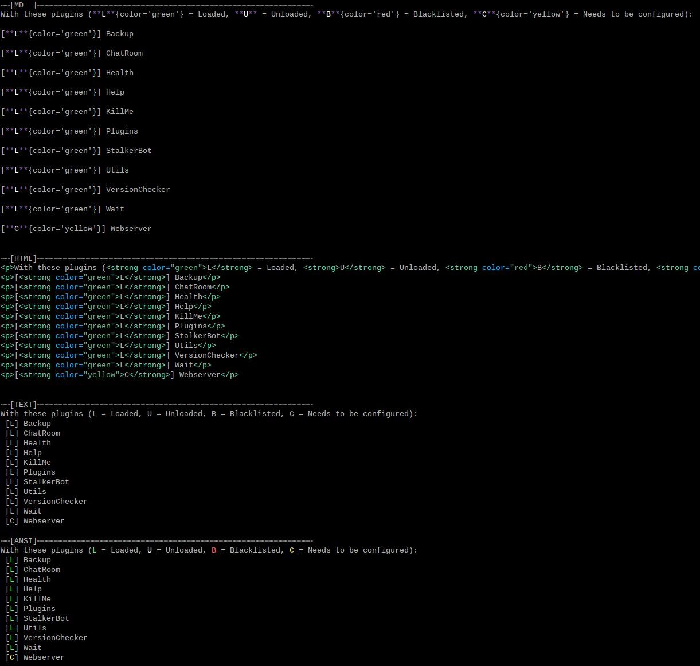

v3.2.3 (2016-02-18)
-------------------

fixes:

- IRC:    Use the NickMask helper for parsing IRC Identity and proper ACL (thx Marcus Carlsson)
- IRC:    Fix random UnicodeDecodeErrors  (thx mr.Shu)
- XMPP:   Fix join on MUCRoom with password (thx Mikko Lehto)
- XMPP:   Fix join on Room list (from CHATROOM_PRESENCE for example) (thx Mikko Lehto)
- Backup: NullBackend was missing few methods and was crashing.
- IRC:    Synchronize join and joined events

v3.2.2 (2015-12-08)
-------------------

fixes:

- shutdown was not called properly anymore leading to possible plugin configuration loss.
- fixed tarfile plugin install
- fixed error reporting on webhook json parsing
- fixed/hacked so the prompt on text mode appear after the asynchronous log entries

features:

- added a warning if the system encoding is not utf-8

v3.2.1 (2015-11-15)
-------------------

other:

- Pypi fixes.

v3.2.0 (2015-11-13)
-------------------

features:

- Official support for Python 3.5
- The API surface is now type hinted (https://www.python.org/dev/peps/pep-0484/) and base classes are tagged Abstract.
- Added send_templated() to the BotPlugin class to be able to use send() with a template
- Various improvements to the ``@arg_botcmd`` decorator.
- Now the bot can set its own status/presence with change_presence
- Non-standard hipchat server (thx Barak Schiller)

fixes:

- Fixed various bugs with the ``@arg_botcmd`` decorator (`#516 <https://github.com/errbotio/errbot/pull/516>`_)
- Fixed warn_admins() on Telegram
- Slack ACLs now properly check against usernames starting with `@`
- Slack identifiers can now be built from a bare `#channel` string (without a username part)
- Slack identifiers can now be built from a `<#C12345>` or `<@username>` string (the webclient formats them like this automatically when chatting with the bot)
- HipChat backend now respects the `server` option under `BOT_IDENTITY` (`#544 <https://github.com/errbotio/errbot/pull/544/>`_)
- The IRC backend will no longer throw UnicodeDecodeError but replaces characters which cannot be decoded as UTF-8 (`#570 <https://github.com/errbotio/errbot/pull/570>`_, Mr. Shu)
- Fixed a bug that would prevent the bot from joining password-protected rooms (`#578 <https://github.com/errbotio/errbot/pull/578>`_, Mikko Lehto)

other:

- various internal improvements and refactoring
- Removed some dead code
- Removed deprecated bare_send and invite_to_room bot methods
- Doc improvements (thx Anita Woodruff)

v3.1.3 (2015-11-12)
-------------------

updated the version checker to errbot.io.

v3.1.2 (2015-11-05)
-------------------

fixes:

- XMPP: self.send on a mess.frm on XMPP was failing
- XMPP: reply to a private message from a chatroom was failing
- blacklist now deactivate automatically a plugin if activated
- unblacklist new activate automatically a plugin

v3.1.1 (2015-10-26)
-------------------

fixes:

- fix regression on !help (thx kromey)

v3.1.0 (2015-10-22)
-------------------

features:

- now setup will install 'errbot' in the path instead of 'err.py' (thx mr.Shu)
- new SUPPRESS_CMD_NOT_FOUND to simply ignore a command if it is not found (thx James O'Beirne)
- err-shellexec in the list of repos (thx Will Fife)
- msg.extras is a new message property to get extra metadata that doesn't fit into a traditional message like attachments for Slack (thx James O'Beirne)
- Terse output
- IRC: now you can use nickserv to auth the bot (thx mr.Shu)
- IRC: COMPACT_OUTPUT option allows you to remove the ascii art around the tables.
- BOT_ADMINS: having a simple string instead of a tuple is possible too (thx mr.Shu)

fixes:

- better error message for unblacklisting (thx Sijis)
- respect optional prefix for re_botcmd (thx Travis Veazey)
- fix breakage on pytest on deps (thx Joel Perras)
- !help foo bar for foo_bar fix + cosmetic (thx James O'Beirne)
- fixed path report for config.py in case of problem
- yield not work with @arg_botcmd (thx Andre Van Der Merwe)
- backup/restore fixes

v3.0.4 (2015-09-12)
-------------------

fixes:

- Small setup.py cleanup
- force XMPP to ascii rendering (xhtml-im is beyond broken)
- Fixed !room list
- Fixed !room occupants [room] on XMPP

v3.0.3 (2015-08-26)
-------------------

fixes:

- fixed the missing path for relative imports in plugins.
- better pre rendering on graphic backend
- better !log tail rendering
- add alt as an alternative modifier on graphic backend (it was problematic on MacOS)

v3.0.2 (2015-08-26)
-------------------

fixes:

- multiple fixes for the graphic backend (it is waaay nicer now)
- missing spots in doc and feedback for for activate/deactivate
- aclattr fix for the slack backend
- status uses more of the markdown goodies

v3.0.1 (2015-08-20)
-------------------

fixes:

- IRC backend not starting.

v3.0.0 (2015-08-17)
-------------------

We have decided to promote this release as the v3 \\o/.

This document includes all the changes since the last stable version (2.2.0).

If you have any difficulty using this new release, feel free to jump into our `dev room on gitter <https://gitter.im/errbotio/errbot>`_.

v3 New and noteworthy
~~~~~~~~~~~~~~~~~~~~~

- backends are now plugins too
- new Slack backend (see the `config template <https://github.com/errbotio/errbot/blob/master/errbot/config-template.py#L118>`_ for details)
- new Telegram backend
- new Gitter backend (see `the gitter backend repo <http://www.github.com/errbotio/err-backend-gitter>`_ for more info about installing it)
- completely new rendering engine: now all text from either a plugin return or a template is **markdown extras**
- you can test the various formatting under your backend with the ``!render test`` command.
- the text backend exposes the original md, its html representation and ansi representation so plugin developers can anticipate what the rendering will look like under various backends.

See the screenshots below: Slack_, Hipchat_, IRC_, Gitter_ and finally Text_.

- completely revamped backup/restore feature (see ``!help backup``).
- Identifiers are now generic (and not tight to XMPP anymore) with common notions of ``.person`` ``.room`` (for MUCIdentifiers) ``.client`` ``.nick`` and ``.displayname`` see `this doc <https://github.com/errbotio/errbot/blob/master/docs/user_guide/backend_development/index.rst#identifiers>`_ for details.
- New ``!whoami`` command to debug identity problems for your plugins.
- New ``!killbot`` command to stop your bot remotely in case of emergency.
- New support for `argparse style command arguments <https://github.com/errbotio/errbot/blob/master/docs/user_guide/plugin_development/botcommands.rst#argparse-argument-splitting>`_ with the ``@arg_botcmd`` decorator.
- IRC: file transfer from the bot is now supported (DCC)

Minor improvements
~~~~~~~~~~~~~~~~~~

- hipchat endpoint can be used (#348)
- XMPP server parameter can be overriden
- deep internal reorganisation of the bot: the most visible change is that internal commands have been split into internal plugins.
- IRC backend: we have now a reconnection logic on disconnect and on kick (see ``IRC_RECONNECT_ON_DISCONNECT`` in the config file for example)

Stuff that might break you
~~~~~~~~~~~~~~~~~~~~~~~~~~

- if you upgrade from a previous version, please install: ``pip install markdown ansi Pygments "pygments-markdown-lexer>=0.1.0.dev29"``
- you need to add the type of backend you use in your config file instead of the command like. i.e. ``BACKEND = 'XMPP'``
- XMPP properties ``.node``, ``.domain`` and ``.resource`` on identifiers are deprecated, a backward compatibility layer has been added but we highly encourage you to not rely on those but use the generic ones from now on: ``.person``, ``.client`` and for MUCOccupants ``.room`` on top of ``.person`` and ``.client``.
- To create identifiers from a string (i.e. if you don't get it from the bot itself) you now have to use ``build_identifier(string)`` to make the backend parse it
- command line parameter -c needs to be the full path of your config file, it allows us to have different set of configs to test the bot.
- campfire and TOX backends are now external plugins: see `the tox backend repo <http://www.github.com/errbotio/err-backend-tox>`_ and `the campfire backend repo <http://www.github.com/errbotio/err-backend-campfire>`_ for more info about installing them.
- any output from plugin is now considered markdown, it might break some of your output if you had any markup characters (\#, \-, \* ...).
- we removed the gtalk support as it is going away.

Bugs squashed
~~~~~~~~~~~~~

- plugin loader do not traverse __pycache__ and dotted directory anymore
- import error at install time.
- IRC backend compatibility with gitter
- Better logging to debug plugin callbacks
- Better dependency requirements (setup.py vs requirements.txt)
- builtins are now named core_plugins (the plan is to move more there)
- a lot of refactoring around globals (it enabled the third party plugins)
- git should now work under Windows
- None was documented as a valid value for the IRC rate limiter but was not.
- removed xep_0004 from the xmpp backend (it was deprecated)

since 3.0.0-rc1:

- imtext was removing the \` for Slack
- corrected the leaking <code><pre> in text/ansi
- fixed a restart loop in Telegram
- clear formatting in the Slack backend for angle brackets [thx @RobSpectre]
- XMPP: allow slashes in resources

Annex
~~~~~

.. _Slack:

Rendering under **Slack**:

.. _Hipchat:

Rendering under **Hipchat**:

.. _IRC:

Rendering under **IRC**:

.. _Gitter:

Rendering under **Gitter**:

.. _Text:

Rendering under **Text** (for plugin development):

v2.3.0-rc2 (2015-07-06)
-----------------------

fixes:

- import error at install time.

v2.3.0-beta (2015-07-05)
------------------------

features:

- new Slack backend
- third party backends (they are plugins too)
- completely revamped backup/restore feature.
- hipchat endpoint can be used (#348)
- XMPP server parameter can be overriden
- Identifiers are now generic (not tight to XMPP anymore)

fixes:

- IRC backend compatibility with gitter
- Better logging to debug plugin callbacks
- Better dependency requirements (setup.py vs requirements.txt)
- builtins are now named core_plugins (the plan is to move more there)
- a lot of refactoring around globals (it enabled the third party plugins)

v2.2.1 (2015-05-16)
-------------------

fixes:

- hipchat keepalive

v2.2.0 (2015-05-16)
-------------------

features:

- New AUTOINSTALL_DEPS config to autoinstall the dependencies required for plugins

fixes:

- Don't 3to2 the config template
- version pinned yapsy because of an incompatibility with the last version
- added timeout to the version check builtin

v2.2.0-beta (2015-02-16)
------------------------

features:

- New serverless tox backend (see http://tox.im for more info)
- New Presence callbacks with status messages etc.
- New file transfert support (upload and downloads) for selected backends
- New MUC management API
- added err-githubhook to the official repo list (thx Daniele Sluijters)
- added err-linksBot to the official repo list (thx Arnaud Vazard)
- added err-stash to the official repo list (thx Charles Gomes)
- shlex.split on split_args_with
- improved !status command (Thx Sijis Aviles)
- colorized log output
- configuration access improvements, it is now a property accessible from the plugins (self.bot_configuration) and the backends.
- bot can optionally name people it replies to in mucs with local conventions toto: or @toto etc... (thx Sijis Aviles)

fixes:

- complete pass & fixes with a static analyser
- better feedback when config.py is borken
- hipchat has been rewritten and goes through the API
- more consistency on properties versus setters/getters
- mac osx fixes (thx Andrii Kostenko)
- unicode fix on irc backend (thx Sijis Aviles)

v2.1.0 (2014-07-24)
-------------------

features:

- Various changes to the test backend:

  - `setUp <http://errbot.io/errbot.backends.test/#errbot.backends.test.FullStackTest.setUp>`_
    method of `FullStackTest` now takes an `extra_plugin_dir` argument, deprecating the
    `extra_test_file` argument.
  - `popMessage` and `pushMessage` are now more pythonically called `pop_message` and
    `push_message`, though the old names continue to work.
  - New `testbot <http://errbot.io/errbot.backends.test/#errbot.backends.test.testbot>`_ fixture
    to write tests using `pytest <http://pytest.org/>`_.

- Better display of active plugins in debug info (#262).
- Allow optional username for IRC backend (#256).
- *Raw* option for the webhook API.
- `Regex-based <http://errbot.io/errbot.decorators/#errbot.decorators.re_botcmd>`_ bot commands.
- Pretty-printed output of the !config command.

fixes:

- Fix make_ssl_certificate on Python 2.
- Newer version of Rocket, fixing an issue with releasing ports on OSX (#268).
- Only run 3to2 during actual install steps (#232).
- Ignore messages from self (#247).
- Import `irc.connection` within try/except block (#245).
- Better message recipient setting in XMPP MUC responses.
- Only configure XMPP MUC when having owner affiliation.
- Use SleekXMPP plugin `xep_0004` instead of deprecated `old_0004` (#236).

v2.0.0 (2014-01-05)
-------------------

features:

- split load/unload from blacklist/unblacklist
- provides a better feedback for 3to2 conversion
- better formatting for plugin list with unicode bullets
- better formatting for !reload
- better feedback on case of !reload problems
- made loglevel configuration (Thx Daniele Sluijters)
- added err-dnsnative to the plugin list.

fixes:

- Fixed a missing callback_connect on plugin activation
- Forced Python 3.3 as a minimal req for the py3 version as deps break with 3.2
- Fixed pip installs during setup.py
- warn_admin breakage on python2
- SSL IRC backend fix
- Various typos.

v2.0.0-rc2 (2013-11-28)
-----------------------

Migrated the version checker to github.io

fixes:

- Fix MUC login: Support tuple & add username
- Language correction (thx daenney)

v2.0.0-rc1 (2013-10-03)
-----------------------

features:

- Added err-faustbot to the official repo list
- Added the !room create command for adhoc room creation (google talk)
- Added sedbot to the official repos
- Added support for plugin based webviews
- Add err-agressive-keepalive to the official repos
- Allow botcmd's to yield values
- Allow configuration of MESSAGE_SIZE_LIMIT

fixes:

- Properly close shelf upon restart (thx Max Wagner)
- Fix inverted display of repo status (private/official) (thx Max Wagner)
- Include jid resource in Message.from/to (Thx Kha)
- Fix messed up display of status and repos commands (thx Max Wagner)
- fixed the standalone execution with -c parameter
- corrected the QT backend under python 3
- hipchat fix
- missing dependencies for SRV records (google compatibility)
- bug in the apropos while adding a command to chatroom
- XMPP: forward HTML of incoming messages (Thx Kha)
- corrected the linkyfier in the graphic interface
- corrected the status display of a plugin that failed at activation stage
- Handle disconnect events correctly

v2.0.0-beta (2013-03-31)
------------------------

features:

- SSL support for webhook callbacks
- JID unicode support
- Per user command history (Thanks to Leonid S. Usov https://github.com/leonid-s-usov)
- HIDE_RESTRICTED_COMMANDS option added to filter out the non accessoble commands from the help  (Thanks to Leonid S. Usov https://github.com/leonid-s-usov)
- err-markovbot has been added to the official plugins list (Thanks to Max Wagner https://github.com/MaxWagner)
- the version parsing now supports beta, alpha, rc etc ... statuses

other:

- python 3 compatibility
- xmpp backend has been replaced by sleekxmpp
- flask has been replaced by bottle (sorry flask no py3 support, no future) [edit from 2016: This is not true anymore].
- rocket is used as webserver with SSL support
- now the IRC backend uses the smpler python/irc package
- improved unittest coverage

v1.7.1 (2012-12-25)
-------------------

fixes:

- unicode encoding on jabber

v1.7.0 (2012-12-24)
-------------------

Incompatible changes:

For this one if your plugin uses PLUGIN_DIR, you will need to change it to self.plugin_dir as it is a runtime value now. 

fixes:

- yapsy 1.10 compatibility 
- better detection of self in MUC
- force python 2 for shebang lines
- Parses the real nick and the room and put it in the from identity of messages
- fix for JID Instance has no attribute '__len__'
- partial support for @ in JIDs nodes
- when a plugin was reloaded, it was not connect notified

features:

- botprefix is now optional on one on one chats
- fine grained access control
- better serialization to disk by default (protocol 2)
- configurable separate rate limiting for IRC for public and private chats
- added support for MUC with passwords
- bot prefixes can be of any length
- modular !help command (it lists the plugin list with no parameters instead of the full command list)

other:

- better unit tests
- Travis CI

v1.6.7 (2012-10-08)
-------------------

fixes:

- the XMPP from was not removed as it should and broke the gtalk compatibility
- fixed 'jid-malformed' error with build_reply()

features:

- new plugin : err-dnsutils https://github.com/zoni/err-dnsutils
- Now you can selectively divert chatroom answers from a list of specified commands to a private chat (avoids flooding on IRC for example)
- the logging can be done using sentry
- Err can now login using SSL on IRC (thx to Dan Poirier https://github.com/poirier)

v1.6.6 (2012-09-27)
-------------------

fixes:

- bot initiated messages were not correctly callbacked on jabber backend
- !apropos was generating an unicode error thx to https://github.com/zoni for the fix
- corrected a serie of issues related to the sharedmiddleware on flask
- fixed a regression on the IRC backend thx to https://github.com/nvdk for helping on those

features:

- added err-mailwatch to the official repo thx to https://github.com/zoni for the contribution
- added a "null" backend to stabilise the web ui

v1.6.5 (2012-09-10)
-------------------

fixes:

- https://github.com/errbotio/errbot/issues/59 [Thx to https://github.com/bubba-h57 & https://github.com/zoni for helping to diagnose it]

features:

- The graphical backend now uses a multiline chat to better reflect some backends.

v1.6.4 (2012-09-04)
-------------------

You will need to add 2 new config entries to your config.py. See below for details

fixes:

- Identity stripping problems
- fixed warn_admin that regressed
- close correctly shelves on connection drop [Thx to linux techie https://github.com/linuxtechie] 
- corrected the !status reporting was incorrect for non configured plugins (label C)
- force a complete reconnection on "See Other Host" XMPP message

features:

- You can now change the default prefix of the bot (new config BOT_PREFIX) [Thx to Ciaran Gultnieks https://github.com/CiaranG]
- Added an optional threadpool to execute commands in parallel (Experimental, new config : BOT_ASYNC)
- Now the bot waits on signal USR1 so you can do a kill -USR1 PID of err to make it spawn a local python console to debug it live
- Now you can have several config_*.py, one per backend (to be able to test specifically a backend without having to reconfigure each time the bot)

v1.6.3 (2012-08-26)
-------------------

fixes:

- !reload was causing a crash on templating
- !update was failing on internal_shelf
- several consistency fixups around Identity and Message, now they should behave almost the same was across all the backends
- corrected several unicode / utf-8 issues across the backends
- unified the standard xmpp and hipchat keep alive, they work the same

features:

- added err-timemachine, an "history" plugin that logs and indexes every messages. You can query it with a lucene syntax over specific dates etc ...
- Added a webserver UI from the webserver builtin plugin (disabled by default see !config webserver to enable it)
- Now if a config structure changed or failed, the bot will present you the config you had and the default template so you can adapt your current config easily
- Added the schema for xhtml-im so you can use your favorite xml editor to check what your templates are generating

v1.6.2 (2012-08-24)
-------------------

fixes:

- missing a dependency for python config [thx to Joshua Tobin https://github.com/joshuatobin]
- Fixing two logging debug statements that are mixed up [thx to Joshua Tobin https://github.com/joshuatobin]
- Removed the URL rewritting from the QT user interface

features:

- Added basic IRC support
- Now the BOT_EXTRA_PLUGIN_DIR can be a list so you can develop several plugins at the same time

v1.6.1 (2012-08-22)
-------------------
Simplified the installation.

fixes:

- put pyfire as an optional dependency as it is used only for the campfire backend
- put PySide as an optional dependency as it is used only for the QT graphical backend

v1.6.0 (2012-08-16)
-------------------

fixes:

- corrected a threading issue that was preventing err to quit
- the python shebangs lines where not generic
- the config path is not inserted first so we don't conflict with other installs
- corrected a corruption of the configs on some persistance stores on shutdown

features:

- Added support for CampFire
- Added support for Hipchat API with basic html messages
- Added support for webhooks
- Independent backends can be implemented
- In order to simplify : now botcmd and BotPlugin are both imported from errbot (we left a big fat warning for the old deprecated spot, they will be removed in next release)
- Better status report from !status (including Errors and non-configured plugins)

v1.5.1 (2012-08-11)
-------------------

fixes:

- the pypi package was not deploying html templates

v1.5.0 (2012-08-10)
-------------------

fixes:

- fix for ExpatError exception handling [Thx to linux techie https://github.com/linuxtechie]
- Graphic mode cosmetics enhancement [thx to Paul Labedan https://github.com/pol51]
- fix for high CPU usage  [Thx to linux techie https://github.com/linuxtechie]

features:

- Added XHTML-IM support with Jinja2 templating
- Better presentation on the !repos command
- load / unload of plugins is now persistent (they are blacklisted when unloaded)
- Better presentation of the !status command : Now you can see loaded, blacklisted and Erroneous plugins from there
- A new !about command with some credits and the current version
- Implemented the history navigation in the graphic test mode (up and down)
- Added an autocomplete in the graphic test mode
- Added the logo in the background of the graphic mode

v1.4.1 (2012-07-13)
-------------------

fixes:

- corrected a vicious bug when you use metaclasses on plugins with botcmd decorator generated with parameters
- don't call any callback message if the message is from the chat history
- dependency problem with dnspython, it fixes the compatibility with google apps [Thx to linux techie https://github.com/linuxtechie]
- on repos updates, err now recheck the dependencies (you never know if they changed after the update)

features:

- Added a new check_configuration callback now by default the configuration check is basic and no implementation has to be done on plugin side
- Warn the admins in case of command name clashes and fix them by prefixing the name of the plugin + -
- A brand new graphical mode so you can debug with images displayed etc ... (command line option -G) it requires pyside [thx to Paul Labedan https://github.com/pol51]
- A new !apropos command that search a term into the help descriptions [thx to Ben Van Daele https://github.com/benvd]
- Now the bot reconnects in case of bad internet connectivity [Thx to linux techie https://github.com/linuxtechie]
- The bot now supports a "remote chatroom relay" (relay all messages from a MUC to a list of users) on top of a normal relay (from a user to a list of MUC) 
     With this you can emulate a partychat mode.
- err-music [thx to Ben Van Daele https://github.com/benvd and thx to Tali Petrover https://github.com/atalyad]

v1.4.0 (2012-07-09)
-------------------
fixes:

- improved the detection of own messages
- automatic rejection if the configuration failed so it the plugin restart with a virgin config

features:

- send a close match tip if the command is not found
- added a polling facility for the plugins
- added loads of plugins to the official repos:
  err-coderwall     [thx to glenbot https://github.com/glenbot]
  err-nettools
  err-topgunbot     [thx to krismolendyke https://github.com/krismolendyke]
  err-diehardbot    [thx to krismolendyke https://github.com/krismolendyke]
  err-devops_borat  [thx to Vincent Alsteen https://github.com/valsteen]
  err-social
  err-rssfeed       [thx to Tali Petrover https://github.com/atalyad]
  err-translate     [thx to Ben Van Daele https://github.com/benvd]
  err-tourney

v1.3.1 (2012-07-02)
-------------------

fixes:

- nicer warning message in case of public admin command

features:

- added a warn_admins api for the plugins to warn the bot admins in case of serious problem
- added err-tv in the official repos list
- added an automatic version check so admins are warned if a new err is out
- now if a repo has a standard requirements.txt it will be checked upon to avoid admins having to dig in the logs (warning: it added setuptools as a new dependency for err itself)

v1.3.0 (2012-06-26)
-------------------

fixes:

- Security fix : the plugin directory permissions were too lax. Thx to Pinkbyte (Sergey Popov)
- Corrected a bug in the exit of test mode, the shelves could loose data
- Added a userfriendly git command check to notify if it is missing

features:

- Added a version check: plugins can define min_err_version and max_err_version to notify their compatibility
- Added an online configuration of the plugins. No need to make your plugin users hack the config.py anymore ! just use the command !config
- Added a minimum Windows support.

v1.2.2 (2012-06-21)
-------------------

fixes:

- Corrected a problem when executing it from the dev tree with ./scripts/err.py
- Corrected the python-daemon dependency
- Corrected the encoding problem from the console to better match what the bot will gives to the plugins on a real XMPP server
- Corrected a bug in the python path for the BOT_EXTRA_PLUGIN_DIR setup parameter

features:

- Added a dictionary mixin for the plugins themselves so you can access you data directly with self['entry']
- admin_only is now a simple parameter of @botcmd
- Implemented the history commands : !history !! !1 !2 !3

v1.2.1 (2012-06-16)
-------------------

fixes:

- Corrected a crash if the bot could not contact the server

features:

- Added a split_args_with to the botcmd decorator to ease the burden of parsing args on the plugin side
- Added the pid, uid, gid parameters to the daemon group to be able to package it on linux distributions

v1.2.0 (2012-06-14)
-------------------

fixes:

- Don't nag the user for irrelevant settings from the setting-template
- Added a message size security in the framework to avoid getting banned from servers when a plugin spills too much

features:

- Added a test mode (-t) to ease plugin development (no need to have XMPP client / server to install and connect to in order to test the bot)
- Added err-reviewboard a new plugin by Glen Zangirolam https://github.com/glenbot to the repos list
- Added subcommands supports like the function log_tail will match !log tail [args]

v1.1.1 (2012-06-12)
-------------------

fixes:

- Fixed the problem updating the core + restart
- Greatly improved the reporting in case of configuration mistakes.
- Patched the presence for a better Hipchat interop.

v1.1.0 (2012-06-10)
-------------------

features:

- Added the !uptime command
- !uninstall doesn't require a full restart anymore
- !update a plugin doesn't require a full restart anymore
- Simplified the usage of the asynchronous self.send() by stripping the last part of the JID for chatrooms
- Improved the !restart feature so err.py is standalone now (no need to have a err.sh anymore)
- err.py now takes 2 optional parameters : -d to daemonize it and -c to specify the location of the config file

v1.0.4 (2012-06-08)
-------------------
- First real release, fixups for Pypi compliance.

.. v9.9.9 (leave that there so master doesn't complain)
