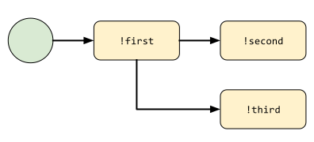
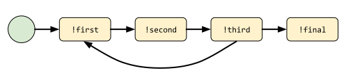

Advanced Flow Definitions
=========================

Storing something in the flow context
-------------------------------------

Flows have a state the plugins can use to store some contextual information.
Let's take back out simple linear flow:

.. code-block:: python

    @botflow
    def example(self, flow: FlowRoot):
        first_step = flow.connect('first')
        second_step = first_step.connect('second')
        third_step = second_step.connect('third')

You can represent this flow like this:

.. figure::  basics_1.svg
   :align:   center

You can store something in the context, for example in ``!first`` and retrieve it in ``!second``. Like this:

.. code-block:: python

    @botcmd
    def first(self, msg, args):
        msg.ctx['mydata'] = 'Hello'
        return 'First done!'

    @botcmd
    def second(self, msg, args):
        return msg.ctx['mydata'] + ' World!'

``msg.ctx`` is a dictionary created every time a flow starts.

Making a step execute automatically
-----------------------------------

In our previous example, if ``msg.ctx['mydata']`` is populated, we can arguably expect that Errbot should not wait for
the user to enter ``!second`` to execute it and just proceed by itself.

You can do that by defining a **predicate**, which is a simple function that returns ``True`` if the conditions
to proceed to the next step are met. The function takes only one parameter, the context, the same one you get from ``msg.ctx``.

.. code-block:: python

    @botflow
    def example(self, flow: FlowRoot):
        first_step = flow.connect('first')
        second_step = first_step.connect('second',
                                         predicate=lambda ctx: 'mydata' in ctx)
        third_step = second_step.connect('third')

Now, after starting the flow with ``!flows start example``, the state will be:

.. figure::  basics_3.svg
   :align:   center

Errbot will wait for ``!first``. But then, once the user executes ``!first``, it will see that the predicate between
``!first`` and ``!second`` is verified, so will go on and execute ``!second``, displaying 'Hello World' and proceed to wait
for ``!third``:

.. figure::  basics_4.svg
   :align:   center

Branching in the graph
----------------------

It is perfectly possible to branch out to several possibilities (possibly with different predicates).

.. code-block:: python

    @botflow
    def example(self, flow: FlowRoot):
        first_step = flow.connect('first')
        second_step = first_step.connect('second',
                                         predicate=lambda ctx: 'mydata' in ctx)
        other = first_step.connect('other_second',
                                   predicate= lambda ctx: 'otherdata' in ctx)

This will do something like that:

In manual mode, the bot will tell the user about his 2 possible options to continue.

Making a looping graph
----------------------

You can also perfectly re-execute a part of a graph in a "loop". You can branch directly the node object
instead of the command name in that case.

.. code-block:: python

    @botflow
    def example(self, flow: FlowRoot):
        first_step = flow.connect('first')
        second_step = first_step.connect('second')
        third_step = second_step.connect('third')
        third_step.connect(first_step, predicate=...)
        final_step = third_step.connect('final', predicate=...)

You can represent this flow like this:

The typical use case is to repeatedly ask something to the user.
