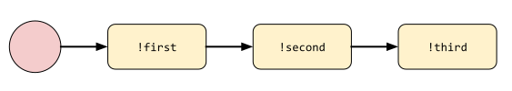
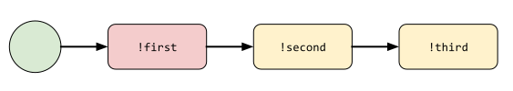
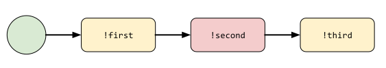

Basic Flow Definition
=====================

Flows are like plugins
----------------------

They are defined by a ``.flow`` file, similar to the plugin ones:

.. code-block:: ini

    [Core]
    Name = MyFlows.
    Module = myflows.py

    [Documentation]
    Description = my documentation.

    [Python]
    Version = 2+

Now in the ``myflows.py`` file you will have pretty familiar structure with a ``BotFlow`` as type and @botflow
as flow decorator:

.. code-block:: python

    from errbot import botflow, FlowRoot, BotFlow

    class MyFlows(BotFlow):
        """ Conversation flows for Errbot"""

        @botflow
        def example(self, flow: FlowRoot):
            """ Docs for the flow example comes here """
            # [...]

Errbot will pass the root of the flow as the only parameter to you flow definition so you can build your graph
from there.

Making a simple graph
---------------------

Within your flow, you can connect commands together.
For example to make a simple linear flow between !first, !second and !third:

.. code-block:: python

    @botflow
    def example(self, flow: FlowRoot):
        first_step = flow.connect('first')           # first is a command name from any loaded plugin.
        second_step = first_step.connect('second')
        third_step = second_step.connect('third')

You can represent this flow like this:

.. figure::  basics_1.svg
   :align:   center

O is the state "not started" for the flow ``example``.

You can start this flow manually by doing ``!flows start example``.

The bot will tell you that it expects a ``!first`` command:

Once you have executed ``!first``, you will be in that state:

The bot will tell you that it expect ``!second`` etc.

Making a flow start automatically
---------------------------------

Now, usually flows are linked to a first action you users want to do. For example: ``!poll new``, ``!vm create``,
``!report init`` or first commands like that that suggests that you will have a follow up.

To trigger automatically a flow on those first commands you can use ``auto_trigger``.

.. code-block:: python

    @botflow
    def example(self, flow: FlowRoot):
        first_step = flow.connect('first', auto_trigger=True)
        second_step = first_step.connect('second')
        third_step = second_step.connect('third')

You can still represent this flow like this:

.. figure::  basics_1.svg
   :align:   center

BUT, when a user will execute a ``!first`` command, the bot will instantly instanciate a Flow in this state:

And tell the user that !second is the follow up.

