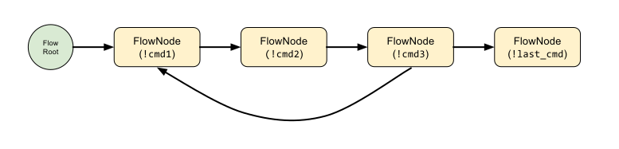

Flows Concepts
==============

Static structure
----------------

Flows are represented as graphs. Those graphs have a root (FlowRoot), which is basically their entry point, and
are composed of nodes (FlowNodes). Every node represents an Errbot command.

   Example of a flow construction.

This defines a simple flow where for example this sequence of commands is possible::

    !command1 !command2 !command3 !command1 !command2 !command3 !last_command

On the connections of those nodes (⟶), you can attach **predicates**, predicates are simple conditions to allow
the flow to continue without any user intervention.

Execution
---------

At execution time, Errbot will keep track of who started the flow, and at what step (node) it is currently.
On top of that, Errbot will initialize a context for the entire conversation. The context is a simple Python dictionary
and it is attached to only one conversation. Think of this like the persistence for plugins, but linked to
a conversation only.

If you don't specify any predicate when you build your flow, every single step is "manual". It means that Errbot will
wait for the user to execute one of the possible commands at every step to advance along the graph.

Predicates can be used to trigger a command automatically. Predicates are simple functions saying to Errbot,
"this command has enough in the context to be able to executed without any user intervention".
At any time if a predicate is verified after a step is executed, Errbot will proceed and execute the next step.
